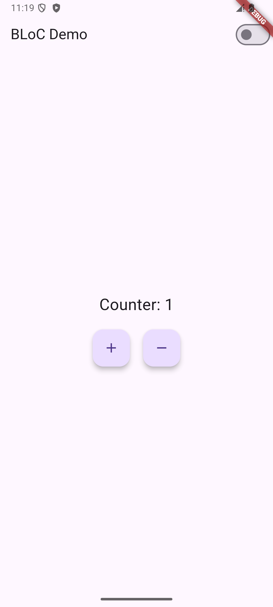
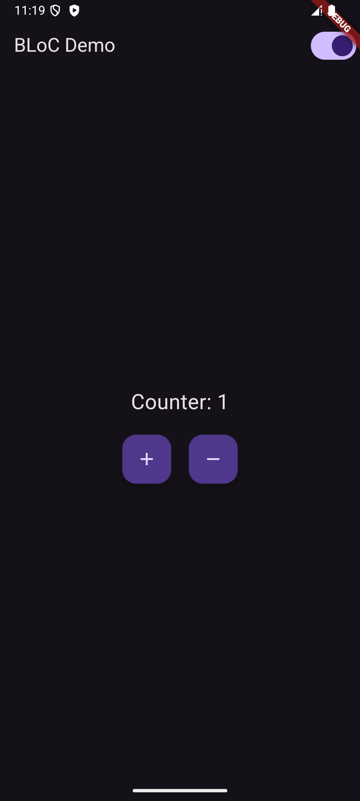

# Flutter BLoC Demo

This project demonstrates the use of the BLoC pattern in Flutter to manage state for a counter and theme toggling.

## Features
- **Counter BLoC**: Manages the state of a counter.
- **Theme BLoC**: Toggles between light and dark themes.
- **BlocConsumer**: Combines BlocListener and BlocBuilder to show a SnackBar when the counter reaches 5.

## Screenshots
 

## How to Run
1. Clone the repository.
2. Run `flutter pub get`.
3. Run `flutter run`.